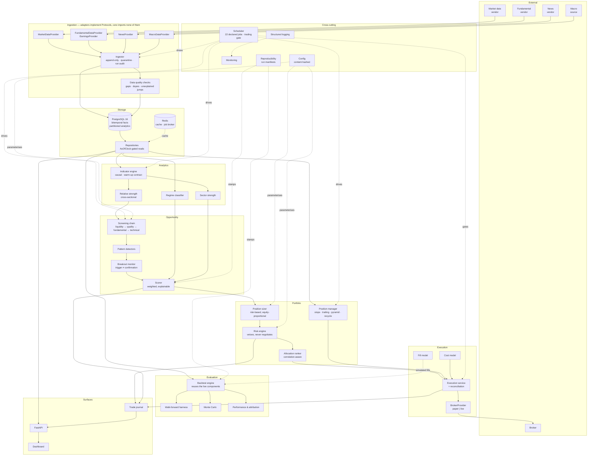
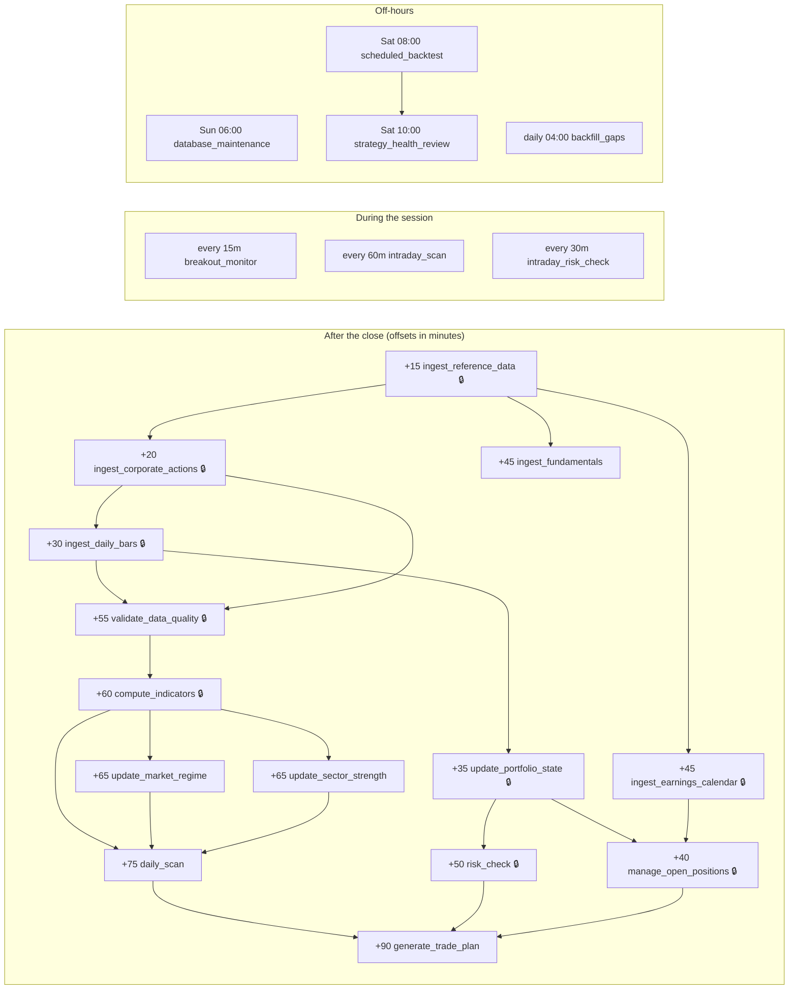
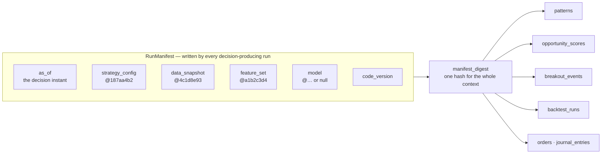
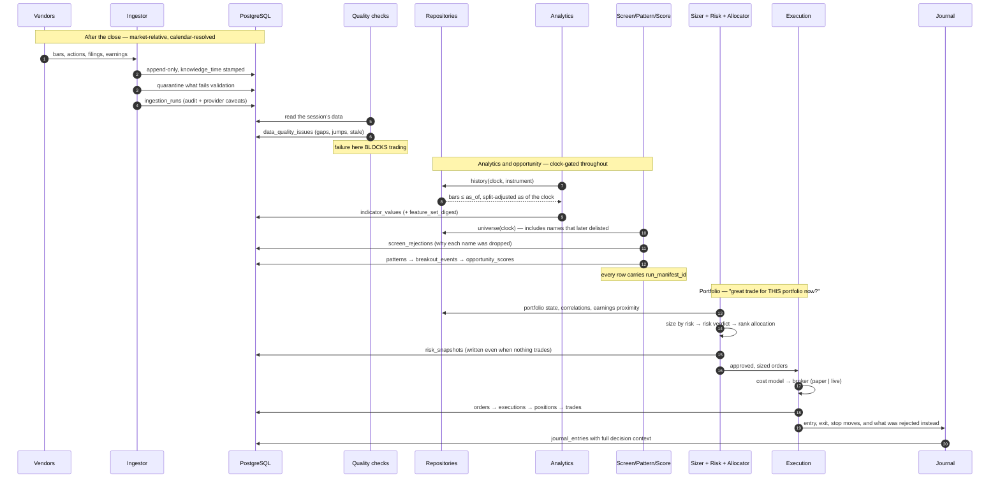

# System Architecture

Complete technical architecture. Phase 1 built the data foundation; this
document specifies everything above it. No trading logic is implemented — what
exists is the schema, the interfaces, the configuration system, and the
contracts each later phase builds against.

**Companion documents:** [Data Model](DATA_MODEL.md) · [API](API.md) ·
[Roadmap](ROADMAP.md) · [ADRs](adr/)

---

## 1. The organising idea

The system is a **portfolio manager**, not a stock picker. A great company with
a great chart may still be a poor use of capital right now — because the
portfolio already holds three names that move with it, because the market regime
is hostile, or because a better use of the same capital exists.

That distinction is structural, not a comment in a scoring function. Opportunity
quality and portfolio fit are separate stages with separate interfaces, and only
the second can authorise a trade:

```
     "is this a great stock?"          "is this a great trade
                                        for this portfolio now?"
    ┌──────────────────────┐          ┌──────────────────────────┐
    │ screen → pattern →   │  ──────► │ size → risk veto →       │ ──► order
    │ breakout → score     │          │ allocate → recycle       │
    └──────────────────────┘          └──────────────────────────┘
        instrument-local                    portfolio-global
```

Underneath sits the constraint everything in the data layer is shaped by: **a
decision may only use information that existed when the decision was made.**

---

## 2. High-level architecture

### Component map



### Module responsibilities

| Module | Responsibility | Phase | Status |
|---|---|---|---|
| **Market data ingestion** | Raw OHLCV + corporate actions, bitemporally stamped | 1 | ✅ Built |
| **Fundamental ingestion** | As-filed financials with real filing timestamps | 1 | ✅ Built |
| **Corporate-event data** | Splits, dividends, earnings dates, symbol changes | 1 | ✅ Built |
| **News / macro ingestion** | Headlines and economic series | — | Interfaces only |
| **Indicator calculation** | Causal transforms with warm-up contracts | 3 | Interface |
| **Pattern recognition** | Base/consolidation geometry; pivot and stop levels | 5 | Interface |
| **Breakout monitoring** | Approach → trigger → confirm → fail lifecycle | 5 | Interface |
| **Scoring** | Weighted factor combination with stored breakdown | 5 | Interface |
| **Portfolio construction** | Sizing, correlation, capital allocation | 6 | Interface |
| **Risk management** | Limit evaluation; the veto before an order exists | 6 | Interface |
| **Backtesting** | Clock-driven replay reusing live components | 8 | Interface |
| **Paper trading** | Same code path as live, different broker adapter | 9 | Interface |
| **Trade journal** | Every decision with its full context | 9 | Schema |
| **Dashboard / API** | Read-mostly surface over produced results | 9 | Spec |
| **Task scheduling** | 22 declared jobs, dependency-ordered, trading gate | 2 | ✅ Declared |
| **Caching** | Redis, keyed by content-addressed manifest | 9 | Design |
| **Logging** | structlog → stdout; audit subset → `system_logs` | 1 | ✅ Built |
| **Monitoring** | Pipeline health, data quality, strategy decay | 9 | Design |

### Deployment topology

A single application image with several entry points, not a fleet of services.
The platform's workload is one daily batch plus intraday polling on a small
watchlist; microservices would add network partitions and deployment skew to
solve a scaling problem that does not exist.

```
┌─────────────┐  ┌─────────────┐  ┌─────────────┐  ┌─────────────┐
│  API        │  │  Scheduler  │  │  Workers    │  │  Dashboard  │
│  (FastAPI)  │  │  (beat)     │  │  4 queues   │  │  (static)   │
└──────┬──────┘  └──────┬──────┘  └──────┬──────┘  └──────┬──────┘
       └────────────────┴────────────────┴────────────────┘
                     PostgreSQL 16  ·  Redis 7
```

Worker queues are separated because their failure modes differ: `realtime`
(intraday monitoring, seconds), `compute` (indicators and scans, minutes),
`backtest` (hours), `maintenance` (partitions, vacuum). A four-hour backtest must
not delay a fifteen-second breakout check.

---

## 3. Repository structure

Present (✅) and planned. Directories exist when they hold something real;
nothing is created empty.

```
tradeit/
├── config/
│   └── strategies/
│       └── baseline.toml                 ✅ every strategy parameter, versioned by hash
│
├── src/tradeit/
│   ├── config.py                         ✅ app settings + live-trading interlock
│   ├── errors.py                         ✅ exception hierarchy
│   ├── logging.py                        ✅ structlog setup
│   ├── cli.py                            ✅ operator commands
│   │
│   ├── core/                             ✅ DOMAIN PRIMITIVES — depends on nothing
│   │   ├── clock.py                          AsOfClock, the leakage guard
│   │   ├── calendar.py                       sessions, holidays, day arithmetic
│   │   ├── models.py                         bitemporal facts
│   │   ├── money.py                          Decimal discipline
│   │   └── enums.py                          persisted vocabularies
│   │
│   ├── data/                             ✅ ACQUISITION
│   │   ├── provider.py                       6 vendor-neutral Protocols
│   │   ├── registry.py                       name-based adapter lookup
│   │   └── providers/
│   │       ├── synthetic.py              ✅   offline, deterministic
│   │       ├── polygon.py                ○    (when a vendor is chosen)
│   │       └── sec_edgar.py              ○
│   │
│   ├── storage/                          ✅ PERSISTENCE
│   │   ├── tables.py                         41-table schema
│   │   ├── session.py                        engine, transaction scope
│   │   └── repositories.py                   the only sanctioned read path
│   │
│   ├── ingest/                           ✅ WRITE PATH
│   │   ├── pipeline.py                       append-only, quarantine, audit
│   │   └── quality.py                    ○   cross-row integrity checks
│   │
│   ├── reproducibility/                  ✅ VERSIONING
│   │   └── versioning.py                     content hashing, run manifests
│   │
│   ├── analytics/                        ✅ interface  ○ implementation
│   │   ├── base.py                       ✅   Indicator, CrossSectionalFeature
│   │   ├── indicators/                   ○    trend, momentum, volatility, volume
│   │   ├── relative_strength.py          ○
│   │   ├── regime.py                     ○
│   │   └── sectors.py                    ○
│   │
│   ├── strategy/                         ✅ interface  ○ implementation
│   │   ├── base.py                       ✅   ScreenFilter, PatternDetector,
│   │   │                                      BreakoutMonitor, OpportunityScorer
│   │   ├── config.py                     ✅   versioned parameters
│   │   ├── filters/                      ○    liquidity, quality, fundamental, technical
│   │   ├── patterns/                     ○    one detector per formation
│   │   ├── breakout.py                   ○
│   │   └── scoring.py                    ○
│   │
│   ├── portfolio/                        ✅ interface  ○ implementation
│   │   ├── base.py                       ✅   PortfolioState, PositionSizer, AllocationRanker
│   │   ├── sizing.py                     ○
│   │   ├── allocation.py                 ○
│   │   ├── correlation.py                ○
│   │   └── management.py                 ○    stops, trailing, pyramiding, recycling
│   │
│   ├── risk/                             ✅ interface  ○ implementation
│   │   ├── base.py                       ✅   RiskRule, RiskEngine, RiskVerdict
│   │   ├── rules/                        ○    one file per limit
│   │   └── engine.py                     ○
│   │
│   ├── execution/                        ✅ interface  ○ implementation
│   │   ├── base.py                       ✅   OrderRequest, Fill, CostModel, FillModel
│   │   ├── costs.py                      ○
│   │   ├── fills.py                      ○
│   │   ├── service.py                    ○    placement + reconciliation
│   │   └── brokers/
│   │       ├── paper.py                  ○
│   │       └── live.py                   ○    behind the interlock
│   │
│   ├── backtesting/                      ✅ interface  ○ implementation
│   │   ├── base.py                       ✅   BacktestSpec, PerformanceMetrics, MonteCarloSpec
│   │   ├── engine.py                     ○    clock loop reusing live components
│   │   ├── walkforward.py                ○
│   │   ├── montecarlo.py                 ○
│   │   └── performance.py                ○
│   │
│   ├── journal/                          ○ RECORD
│   ├── scheduling/                       ✅
│   │   ├── jobs.py                       ✅   22 declared jobs, validated catalogue
│   │   └── runner.py                     ○    Celery binding
│   │
│   ├── api/                              ○ SURFACE
│   │   ├── app.py  deps.py  security.py
│   │   ├── routers/                          scanner, portfolio, risk, backtest, journal, config
│   │   └── schemas/                          request/response models, distinct from domain
│   │
│   └── monitoring/                       ○ health, metrics, decay detection
│
├── ui/                                   ○ dashboard (framework TBD)
├── migrations/versions/                  ✅ 0001_initial, 0002_phase2_schema
├── tests/
│   ├── unit/                             ✅ 178 tests
│   ├── integration/                      ✅ 25 tests (SQLite + PostgreSQL 16)
│   ├── data_validation/                  ○ vendor conformance
│   └── regression/                       ○ golden-output signal replay
└── docs/                                 ✅ architecture, data model, API, ADRs, phase reports
```

**Dependency rule.** Imports point downward only:

```
api · ui
  └── backtesting · execution
        └── portfolio · risk
              └── strategy
                    └── analytics
                          └── storage (repositories)
                                └── data
                                      └── core
```

`core` imports nothing from the project. `storage` is the only module that
touches the database. Nothing above `storage` writes SQL — which is what makes
the point-in-time guarantee hold transitively rather than by vigilance.

---

## 4. Database architecture

Full specification in **[DATA_MODEL.md](DATA_MODEL.md)** — 41 tables across five
domains with primary keys, foreign keys, indexes, unique constraints and
partitioning, plus Mermaid ERDs per domain.

Summary of what is new in Phase 2 (32 tables):

| Domain | Tables |
|---|---|
| Reference | `sectors`, `news_items`, `macro_observations` |
| Reproducibility | `artifact_versions`, `run_manifests`, `data_snapshots` |
| Analytics | `indicator_values`*, `market_regime_states`, `sector_strength` |
| Opportunity | `patterns`, `breakout_events`, `opportunity_scores`, `watchlists`, `watchlist_members`, `screen_rejections` |
| Strategy & portfolio | `strategies`, `strategy_configurations`, `portfolios`, `positions`, `orders`, `executions`, `trades`, `portfolio_snapshots`, `risk_snapshots` |
| Evaluation | `backtest_runs`, `backtest_trades`, `monte_carlo_runs`, `model_metadata` |
| Operations | `journal_entries`, `job_runs`, `data_quality_issues`, `system_logs`* |

\* range-partitioned monthly.

**Validation performed, not asserted.** The migration was applied to
PostgreSQL 16; 18 integration tests confirm partition routing, pruning (26 of 28
subplans eliminated), retention by partition drop, JSONB containment queries, and
seven CHECK constraints. A drift test runs Alembic autogenerate against the live
schema and fails if the ORM and migrations disagree — it was verified to catch a
deliberately introduced column.

---

## 5. Time-series storage: PostgreSQL alone

**Decision: plain PostgreSQL 16 with native declarative partitioning. No
TimescaleDB.** Full reasoning in [ADR-0006](adr/0006-postgresql-without-timescaledb.md).

The short version: this workload is not what TimescaleDB is for.

| | This platform | TimescaleDB's strength |
|---|---|---|
| Write pattern | ~1M rows/day, one batch after the close | Continuous high-frequency ingest |
| Row count | ~40M/year (indicators), ~1M/year (bars) | Billions |
| Dominant read | Point-in-time slices bounded by `knowledge_time` | Time-bucketed aggregates |
| Aggregation | Small windows per instrument | Continuous aggregates over huge ranges |

The features that would justify it — continuous aggregates, hypertable
compression, `time_bucket` — address problems we do not have. Meanwhile the
costs are real: an extension pinned to specific PostgreSQL versions, a managed
hosting constraint, an upgrade path coupled to a third party, and hypertables
that interact awkwardly with the `EXCLUDE` constraints the identity model
depends on.

Native partitioning already gives pruning, retention by `DROP TABLE`, and
per-partition maintenance — measured above.

**When to revisit:** intraday bars at minute resolution across a full universe
(~390× the daily row count), or a demonstrated planning-time problem on
`indicator_values`. Both are recorded as triggers, not vague intentions. Because
the schema uses standard partitioning, converting a table to a hypertable later
is a migration, not a redesign.

---

## 6. Data provider abstraction

Six capability-split `Protocol` classes in `src/tradeit/data/provider.py`. An
adapter implements only what its vendor actually supplies, and nothing in the
core imports a vendor module — swapping vendors is a config change plus one
adapter file.

```python
@runtime_checkable
class MarketDataProvider(Protocol):
    name: str
    def fetch_bars(self, instrument_id: int, start: date, end: date,
                   timeframe: Bartimeframe = Bartimeframe.D1) -> Iterable[OhlcvBar]: ...
    def fetch_corporate_actions(self, instrument_id: int, start: date,
                                end: date) -> Iterable[CorporateAction]: ...

@runtime_checkable
class FundamentalDataProvider(Protocol):
    name: str
    def fetch_fundamentals(self, instrument_id: int, metrics: Sequence[str],
                           start: date, end: date) -> Iterable[FundamentalFact]: ...

@runtime_checkable
class EarningsProvider(Protocol):
    name: str
    def fetch_earnings(self, instrument_id: int, start: date,
                       end: date) -> Iterable[EarningsEvent]: ...

@runtime_checkable
class NewsProvider(Protocol):
    name: str
    def fetch_news(self, instrument_id: int, start: datetime,
                   end: datetime) -> Iterable[NewsItem]: ...

@runtime_checkable
class MacroDataProvider(Protocol):
    name: str
    def fetch_series(self, series_id: str, start: date,
                     end: date) -> Iterable[MacroObservation]: ...
    def list_series(self) -> Iterable[str]: ...

@runtime_checkable
class BrokerProvider(Protocol):
    name: str
    supports_fractional_shares: bool
    def get_account(self) -> BrokerAccount: ...
    def list_positions(self) -> Iterable[BrokerPosition]: ...
    def submit_order(self, order: object, client_order_id: str) -> BrokerOrderStatus: ...
    def cancel_order(self, broker_order_id: str) -> BrokerOrderStatus: ...
    def get_order(self, broker_order_id: str) -> BrokerOrderStatus: ...
    def is_market_open(self) -> bool: ...
```

**Rules every data adapter honours** (`BrokerProvider` is the documented
exception — it reports live state, not historical facts):

1. Return validated domain objects, not DataFrames.
2. Populate `knowledge_time` honestly, marking `REPORTED` vs `ESTIMATED`.
3. Never look at the clock. Visibility filtering is the repository's job, so one
   stored row serves both a 2019 backtest and today's screen.
4. Declare limitations in `ProviderCapabilities`.

`ProviderCapabilities` is not documentation. It is recorded on every ingestion
run, and `caveats()` produces the strings that appear in
`backtest_runs.data_caveats` and in API responses:

```python
caps.backtest_grade   # reported timestamps AND delisted names AND unadjusted prices
caps.caveats()        # ["no delisted instruments: the universe is survivorship-biased …"]
```

Broker adapters carry two additional obligations: check `settings.is_live`
themselves rather than trusting the caller, and accept a client-generated
`client_order_id` so a retried submission after a network timeout is a no-op
rather than a second position.

**Conformance suite.** `tests/unit/test_synthetic_provider.py` asserts the
properties any honest adapter has — deterministic reads, bars only on trading
sessions, `knowledge_time` after the close, announcements before their events.
New adapters must pass it.

---

## 7. Configuration system

Two distinct kinds of configuration, deliberately separated:

| | **Application settings** | **Strategy configuration** |
|---|---|---|
| What | DSNs, log level, trading mode, provider names | Every threshold, weight, lookback, limit |
| Where | environment / `.env` (`src/tradeit/config.py`) | TOML under `config/strategies/` |
| Identity | none | SHA-256 of canonical content |
| Changes | deployment | reviewable diff, new hash, new strategy |

**The rule: no number that affects a trading decision may be written in Python.**
Not a default argument, not a module constant, not a literal inside a detector.
`src/tradeit/strategy/config.py` defines eleven validated sections — universe,
liquidity, fundamental, technical, patterns, breakout, scoring, sizing, risk,
exits, costs — and `config/strategies/baseline.toml` supplies them.

Three properties that are the point rather than side effects:

```python
config = StrategyConfig.from_toml("config/strategies/baseline.toml")
config.label                                   # 'baseline@187aa4b2675e'
tweaked = config.with_overrides(**{"sizing.risk_per_trade_pct": 0.01})
config.differs_from(tweaked)                   # ['sizing.risk_per_trade_pct']
```

- A backtest and a live session sharing a hash **provably** ran the same rules.
- Editing the `description` does **not** change the hash — prose is not a rule,
  and treating it as one would break the link between a live session and the
  backtest that validated it.
- Weights are normalised before hashing, so `{0.5, 0.5}` and `{1.0, 1.0}` are
  correctly the same strategy.
- Parameter sweeps generate configurations rather than patching globals, so
  every variation tried is enumerable — the only defence against reporting the
  best of two hundred attempts as if it were the first of one.

`extra="forbid"` on every section means a typo'd key is an error, not a silent
fallback to a default the author did not intend.

**Cross-section validation** catches configurations that satisfy every field
constraint yet are incoherent as a whole:

- per-trade risk exceeding portfolio heat → no position could ever open
- breakeven-stop R above trailing-stop R → the trailing stop is looser than the
  breakeven stop it replaces
- a single position permitted to exceed gross exposure
- a relative-strength lookback longer than the required trading history → every
  instrument passing the liquidity filter fails on warm-up, and the screen
  silently returns nothing

All four are tested. A `POST /configurations/validate` endpoint runs the same
validators so a proposed change fails in review rather than at 21:15 on a
trading day.

---

## 8. Scheduling

22 jobs declared in `src/tradeit/scheduling/jobs.py`, validated as a unit test.
Declaration is separate from execution: the schedule is a reviewable design
artifact, not something reconstructed by reading Celery decorators.

Every job is **idempotent** (running twice for a session equals running once),
**explicitly ordered** (`depends_on`, not "it runs later so it will be fine"),
and **honest about failure** (`blocks_trading`).

**Market-relative triggers.** Jobs tied to the session use
`MARKET_CLOSE_OFFSET` and are resolved through the exchange calendar at run
time. A cron expression would run three hours after a 13:00 half-day close, and
would drift by an hour twice a year at the DST boundary.

### Daily pipeline



🔒 = `blocks_trading`. Nine jobs carry it.

**The trading gate.** Before `generate_trade_plan` runs, the system verifies
every `blocks_trading` job completed for the session by querying `job_runs`. A
failed ingestion followed by a successful scan would otherwise produce
recommendations built on yesterday's prices — worse than no recommendations. A
unit test asserts that no blocking job depends on a non-blocking one, which
would make the gate porous.

**`database_maintenance` creates partitions two months ahead.** Discovering a
missing partition at ingest time means a failed load; an empty partition costs
nothing.

**`scheduled_backtest` re-runs the reference backtest weekly** and compares
against the stored baseline, so strategy decay and accidental behaviour changes
surface without anyone remembering to look.

---

## 9. API design

Full specification in **[API.md](API.md)**.

Design stance: **read-mostly**. The API surfaces what the pipeline produced. It
does not screen on demand — an inline scan would produce a result with no
manifest, which is a result nobody can reproduce.

Endpoint groups: `/scans` · `/candidates` · `/patterns` · `/breakouts` ·
`/portfolios` · `/positions` · `/risk` · `/backtests` · `/journal` ·
`/strategies` + `/configurations` · `/jobs` + `/data-quality`.

Four decisions worth stating here:

- **Every decision response carries its manifest.** A score without its config
  and data digests is an opinion.
- **`as_of` is a first-class query parameter**, defaulting to now. The API uses
  the same clock as the pipeline, so it cannot see what the pipeline could not.
- **No endpoint places an order, in any mode.** Not an authorisation setting —
  the path does not exist. Order placement lives behind the live-trading
  interlock, and exposing it over HTTP would put that interlock behind a network
  boundary a token compromise could cross.
- **Money is a decimal string in JSON**, never a float.

Cache keys include the manifest digest, so an entry is valid until the
underlying run changes — no TTL guessing, and no risk of serving a result
computed from a configuration that has since been replaced.

---

## 10. Data integrity

Two layers. Phase 1 built row-level validation; Phase 2 specifies the
cross-row checks that no single row can reveal.

| Threat | Safeguard | Where | Status |
|---|---|---|---|
| **Missing candles** | Compare bars against the exchange calendar; a session with no bar for a listed instrument raises an issue rather than looking like a holiday | `validate_data_quality` → `data_quality_issues` | Designed |
| **Duplicate data** | `UNIQUE(business key, knowledge_time)` + `ON CONFLICT DO NOTHING`; replay is a no-op, revision is a new row | Schema | ✅ Built |
| **Bad splits** | Flag any close-to-close move beyond a threshold with no corporate action within ±1 session. Catches both a missing split and a spurious one | `validate_data_quality` | Designed |
| **Bad earnings records** | Reject `knowledge_time == period_end`; distinguish `is_confirmed`; flag dates that move more than N days | Ingestor + checks | ✅ Partly |
| **Timezone errors** | `UTCDateTime` rejects naive datetimes on write, attaches UTC on read; `AsOfClock` refuses naive input; sessions resolved through the calendar | Type layer | ✅ Built |
| **Future data leakage** | `knowledge_time <= as_of` on every read; no "latest data" API; DB CHECK `knowledge_time >= event_time`; clock cannot rewind | Repositories + schema | ✅ Built |
| **Corporate-action errors** | Raw prices only, adjusted on read from actions the clock could see; volume scaled inversely so dollar volume is invariant | ADR-0005 | ✅ Built |
| **Silent data loss** | Quarantine with verbatim payload; never drop | `quarantined_rows` | ✅ Built |
| **Stale series** | Flag instruments whose last bar predates the last session while still listed | `validate_data_quality` | Designed |
| **Partial job failure** | `blocks_trading` gate consulted before any plan is generated | `job_runs` | ✅ Declared |

Two structural points:

**`data_quality_issues` is distinct from `quarantined_rows`.** The latter holds
rows that failed to parse; the former holds problems detected *across* rows — a
missing session, an unexplained jump, a stale series. Those are invisible row by
row.

**Failing validation stops trading.** `validate_data_quality` carries
`blocks_trading`, because acting on data known to be bad is worse than not
acting.

---

## 11. Reproducibility

**Requirement: every historical signal must be reproducible exactly as it
existed at that moment.** Five things must be pinned, and
`src/tradeit/reproducibility/versioning.py` pins them.



**Versions are content hashes, not sequence numbers.** `v3` tells you nothing
about whether two runs used the same rules, and nothing stops someone editing
`v3` in place. Identity *is* content: two runs with the same digest provably
used the same configuration, and changing one threshold produces a different
identity with no discipline required from anyone.

Canonicalisation is the load-bearing detail: JSON with sorted keys, no
insignificant whitespace, Decimals rendered as strings — so one configuration
cannot produce three hashes depending on how it was serialised.

**Why `data_snapshot` exists.** Bounding reads by `as_of` is *almost* enough. If
a backfill lands after a scan, replaying that scan at the same `as_of`
legitimately sees rows the original did not — their `knowledge_time` precedes
`as_of`, they simply had not been loaded. Pinning the maximum `ingestion_run_id`
per dataset makes replay exact rather than merely honest. This is the subtlest
leak in the design and the one most likely to be missed.

**Model versioning is specified before any model exists.** `model_metadata`
records `training_start`/`training_end`, with a CHECK that validation cannot
start before training ends. A model introduced later without those boundaries is
a model whose look-ahead status cannot be audited, and retrofitting is far harder
than recording from the start.

```python
manifest.reproduces(other)   # same as_of, config, data, features, model, code
manifest.describe()          # flat summary for logs, reports, API
```

If replaying a manifest yields a different answer, either the code changed or
something that should have been pinned was not — and that gap is itself the
finding.

---

## 12. Security

| Concern | Approach |
|---|---|
| **Secrets management** | Never in code, config files, or the repository. Environment variables in development (`.env`, gitignored); a secrets manager in production, injected at container start. `config/strategies/*.toml` is committed and must contain no credential — it is strategy parameters only. |
| **API credentials** | Per-vendor keys held only by the adapter that needs them. Rotation without redeploy: adapters read at call time, not import time. Rate limits declared in `ProviderCapabilities` so a retry storm cannot get a key banned. |
| **Broker credentials** | Separate from every other secret, separate for paper and live, and never in the same namespace. A live broker key present in a paper environment is a misconfiguration the deployment must reject. |
| **Database credentials** | Three roles: `tradeit_app` (DML on application tables, no DDL), `tradeit_migrate` (DDL, used only by Alembic), `tradeit_read` (SELECT, for the dashboard and analysis). The application cannot alter its own schema at runtime. |
| **Access controls** | API roles `viewer` / `operator` / `admin` (see [API.md](API.md)). No role can place an order — the endpoint does not exist. |
| **Live-trading interlock** | Config flag **plus** an out-of-band authorisation file with an exact phrase ([ADR-0004](adr/0004-live-trading-safety-interlock.md)). A stray `TRADEIT_TRADING_MODE=live` in CI cannot send orders. Tested. |
| **Audit trail** | Every mutating API call, configuration activation, risk override and interlock trip writes to `system_logs` with actor, payload digest and resulting state. |
| **Transport** | TLS everywhere; the database is not exposed publicly; the API sits behind a reverse proxy. |
| **Dependency supply chain** | Pinned lockfile, `pip-audit` in CI, no unvetted runtime dependency added for convenience. |

**The threat model this is calibrated against** is not a sophisticated attacker.
It is an operational accident: a `.env` copied between environments, a live key
in a test harness, a token with more scope than intended. Those are the failures
that actually cost money in a system like this, and the controls above target
them specifically.

---

## 13. Testing architecture

185 tests today; the categories below define where new ones go.

| Category | Scope | Runs on | Status |
|---|---|---|---|
| **Unit** | Pure logic: clock, calendar, money, models, config, versioning, job catalogue | In-memory | ✅ 160 |
| **Integration** | Pipeline end-to-end; schema against real PostgreSQL 16 | SQLite + PG | ✅ 25 |
| **Data validation** | Vendor conformance: does an adapter honour the provider contract? | Recorded fixtures | Designed |
| **Regression** | Golden-output replay: a stored manifest must reproduce its stored signals | PG | Designed |
| **Backtest sanity** | Property tests that catch a lying backtester | PG | Designed |
| **Execution** | Order lifecycle, idempotency, reconciliation, interlock | Fake broker | Designed |

**Property tests that must exist before the logic they guard:**

- *Causality* — computing an indicator over `bars[:k]` must equal the first *k*
  values of computing it over all bars, for every *k*. This catches centred
  windows, full-sample normalisation and off-by-one leakage, which no
  example-based test reliably finds.
- *Sizing monotonicity* — doubling equity with all else constant doubles the
  position. This is what makes returns compound in percentage terms.
- *Risk monotonicity* — tightening any limit can never increase a position.
- *No fill outside the bar's range* — a limit at 100 does not fill on a day
  whose low was 100.50.
- *Gaps are respected* — a stop at 50 on a day opening at 44 fills at 44.
  Backtests assuming stops fill at their trigger price systematically understate
  drawdown.
- *Backtest/live parity* — the same inputs through the backtester and through
  the live path produce the same orders. This is what makes a backtest evidence
  about the live system rather than about a program that resembles it.

**The tests that matter most** remain `tests/unit/test_point_in_time.py`. If
those regress, every backtest this platform produces is fiction.

CI runs lint (ruff), format check, strict typing (mypy, 39 modules), and the
full suite against a real PostgreSQL 16 service container.

---

## 14. Data flow



The loop closes: `trades` and `journal_entries` feed post-trade analysis and the
weekly `strategy_health_review`, which compares live results against backtested
expectations and flags statistically significant degradation.

---

## 15. Implementation order

Sequenced so that **nothing is built on an unverified foundation**. Backtesting
comes after portfolio construction because there is no point measuring a
strategy whose sizing does not exist; machine learning comes last or never.

| Phase | Deliverable | Requires | Key risk it retires |
|---|---|---|---|
| 1 ✅ | Point-in-time data layer | — | Look-ahead bias, survivorship |
| 2 ✅ | Architecture, schema, interfaces, config | 1 | Design churn during implementation |
| 3 | Causal indicators, relative strength, regime, sectors | Benchmark + sector scheme | Leakage in "respectable" transforms |
| 4 | Screening chain, versioned filter definitions | 3, vendor decision | Unreproducible screens |
| 5 | Patterns, breakout confirmation, scoring | 4 | Buying failed breakouts |
| 6 | Sizing, risk engine, allocation, position management | 5, capital params | Uncontrolled portfolio risk |
| 7 | Cost and fill models, paper broker, execution service | 6 | Unrealistic fills |
| 8 | Backtest engine, walk-forward, Monte Carlo, attribution | 7 | Overfitting; no measured edge |
| 9 | Paper trading, journal, API, dashboard, monitoring | 8 | Operating blind |
| 10 | Live trading | 9 + separate written authorisation | Real capital |

Phase 7 sits before Phase 8 deliberately: the backtester must use the same cost
and fill models the paper broker uses, so building execution first prevents the
backtester from growing its own optimistic assumptions.

**Machine learning is unscheduled.** It becomes worth adding when a rule-based
baseline shows a validated edge across several hundred out-of-sample trades.
Introduced earlier, it mostly launders look-ahead bias into a plausible-looking
score.

**Live trading requires separate written authorisation** and stays disabled
regardless of how much of the above is complete.
