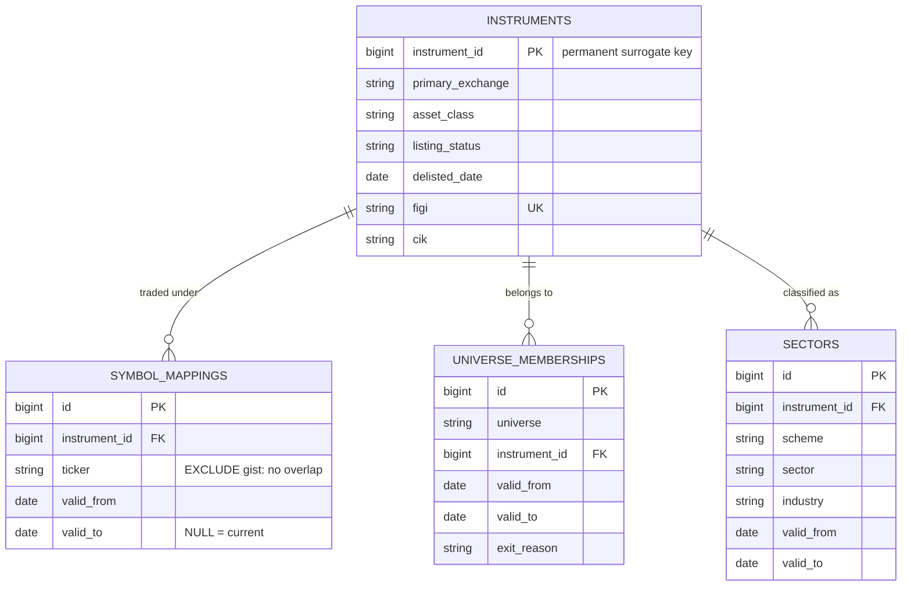
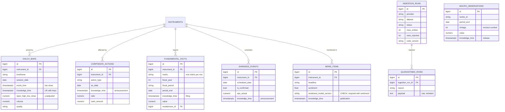
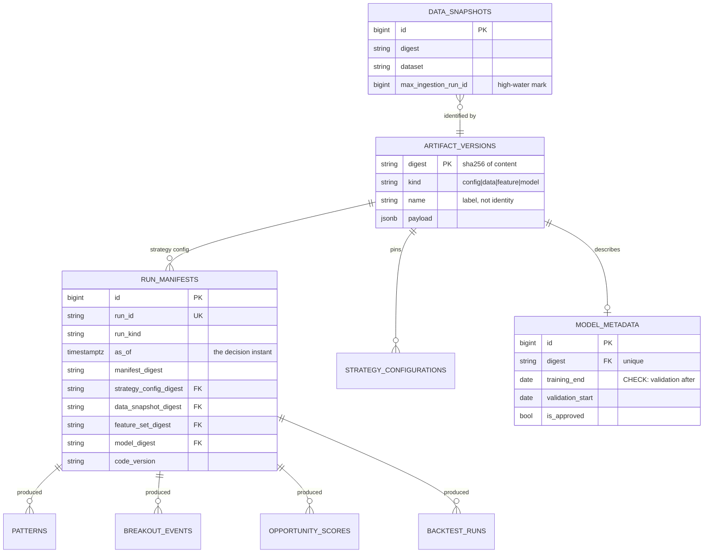
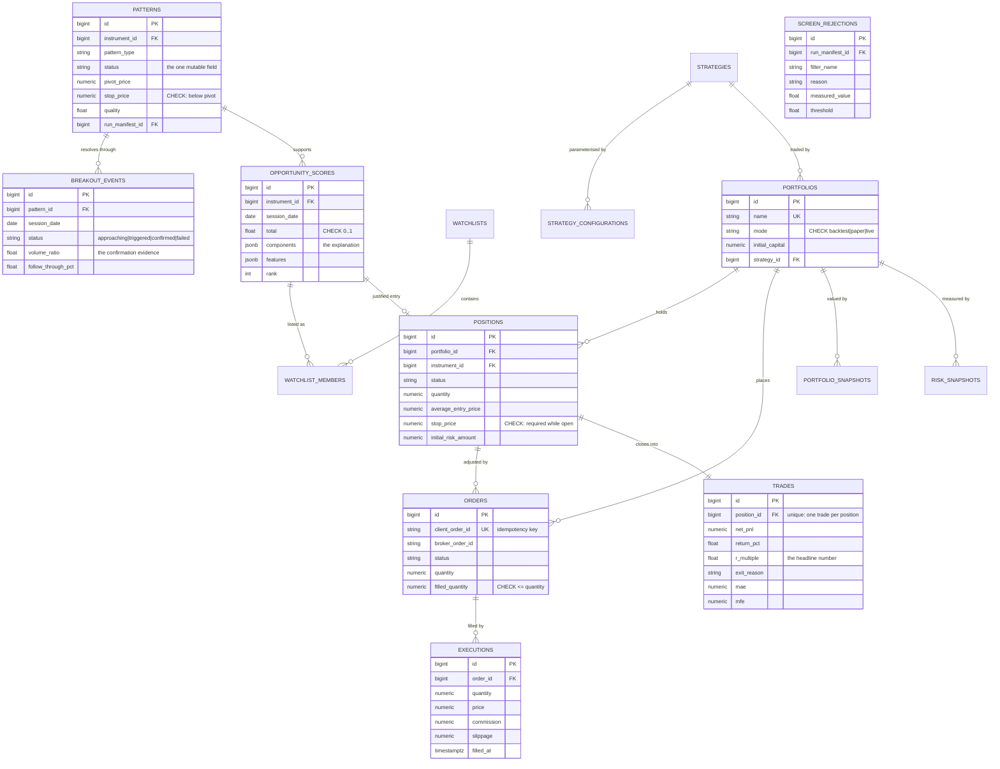
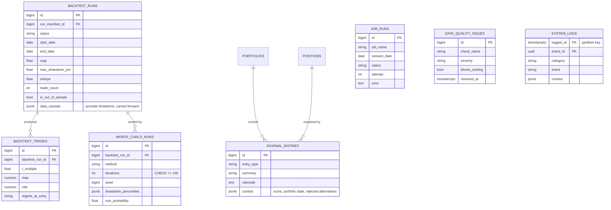

# Data Model

49 tables in six domains. Every table is defined in `src/tradeit/storage/tables.py`
and created by `migrations/versions/`. The schema has been applied to
PostgreSQL 16 and is verified by `tests/integration/test_phase2_schema.py`,
which includes a drift check asserting the ORM and the migrations still agree.

> The five analytics tables added in Phase 3 — `relative_strength_values`,
> `market_breadth_snapshots`, `volatility_regime_states`, `feature_definitions`
> and `feature_set_members` — are described in
> [PHASE_03.md §10](PHASE_03.md#10-database-changes). `relative_strength_values`
> is range-partitioned monthly like `indicator_values`.

## The three kinds of table

The distinction drives most design decisions below.

| Kind | Mutability | Identity | Examples |
|---|---|---|---|
| **Facts** — things observed | Append-only, bitemporal | business key + `knowledge_time` | `ohlcv_bars`, `fundamental_facts`, `news_items` |
| **Derived** — things computed | Recomputable, replaced | business key + `feature_set_digest` | `indicator_values`, `opportunity_scores` |
| **Decisions** — things done | Immutable once written | surrogate + `run_manifest_id` | `executions`, `trades`, `journal_entries` |

Facts get revision history because a vendor can correct them and we must
remember what we believed. Derived data does not, because it can be recomputed
from facts plus a configuration — but it must record *which* configuration.
Decisions get neither, because they happened.

---

## Domain 1 — Identity and reference data

**Why intervals everywhere.** Tickers are recycled, universe membership changes,
and companies get reclassified. Every one of these is a half-open date range, so
resolving any of them requires a date. A PostgreSQL `EXCLUDE USING gist`
constraint on `symbol_mappings` makes two overlapping claims on one ticker
impossible while still permitting legitimate reassignment — verified in
`tests/integration/`.

**Why sectors are dated too.** A company reclassified from Technology to
Communication Services in 2018 was in Technology in 2017. A sector-rotation
backtest using today's mapping for all history is measuring a different
strategy from the one it claims to.

---

## Domain 2 — Facts

Established in Phase 1 and unchanged; `news_items` and `macro_observations` are
new and follow the same bitemporal contract. Every fact table's uniqueness
constraint includes `knowledge_time`, so revisions coexist rather than
overwrite, and every index leads with the point-in-time query shape.

`macro_observations` carries `vintage` because macro data is revised more
aggressively than anything else here — employment twice, GDP three times — and
vendor APIs typically serve only the current revision. Backtesting a regime
model on revised macro data produces a model that could not have existed.

---

## Domain 3 — Reproducibility

**`artifact_versions.digest` is the primary key.** Identity *is* content, so
inserting the same configuration twice is a no-op and two rows can never
disagree about what a digest means.

**`data_snapshots` closes a subtle reproducibility gap.** Bounding reads by
`as_of` is not quite sufficient: a backfill landing after a scan adds rows whose
`knowledge_time` precedes that scan's `as_of`, so replaying it legitimately sees
data the original run did not. Pinning the maximum `ingestion_run_id` per
dataset makes replay exact rather than merely honest.

---

## Domain 4 — Opportunity and portfolio

Four things worth calling out:

**`positions.stop_price` is enforced by CHECK while open.** A position without a
stop has undefined risk, cannot be sized, and cannot be aggregated into
portfolio heat. It is not a position this system will hold.

**`orders.client_order_id` is unique and generated before submission.** That
ordering is what makes retrying a timed-out submission safe: the same id is a
no-op at the broker rather than a second position.

**`executions` is the ground truth.** A position's average entry price is
derivable from its fills; if the two ever disagree, the executions are right.

**`screen_rejections` records what did *not* pass.** Storing only the survivors
makes "why isn't NVDA on the list?" answerable only by re-running the whole
chain.

---

## Domain 5 — Evaluation and operations

**`backtest_trades` is separate from `trades` on purpose.** They are structurally
near-identical, and that is exactly the risk: one accidental `UNION` between
simulated and real fills turns a live performance report into fiction. Separate
tables make that mistake require intent.

**`backtest_runs.data_caveats` carries provider limitations forward** from
ingestion — survivorship-unsafe universe, estimated filing dates, adjusted-only
prices — so a result cannot be quoted as clean when the data underneath it was
not. Eight months later nobody remembers which vendor was in use.

**`job_runs` is the trading gate.** Before generating a plan, the system checks
that every `blocks_trading` job completed for the session. Nine of the 22
catalogued jobs carry that flag.

---

## Partitioning

Two tables are range-partitioned; the rest are not, and that asymmetry is
deliberate. Partitioning costs planning time and operational complexity, so it
is applied where row counts justify it and nowhere else.

| Table | Key | Interval | Rationale |
|---|---|---|---|
| `indicator_values` | `session_date` | monthly | ~40M rows/year (4,000 instruments × 40 indicators × 252 sessions). Every query is date-bounded, so pruning eliminates almost all of it. |
| `relative_strength_values` | `session_date` | monthly | ~12M rows/year (4,000 × 3 benchmarks × 4 lookbacks × 252). Same query shape. |
| `system_logs` | `logged_at` | monthly | High write volume, short useful life, retention by partition drop. |

Both use a **natural composite primary key** rather than a surrogate id.
PostgreSQL requires a partitioned table's primary key to contain the partition
column, and for `indicator_values` nothing references a row by id anyway — the
natural key `(instrument_id, session_date, indicator, timeframe,
feature_set_digest)` is already unique, and a `BIGSERIAL` plus its index would
be pure overhead at that scale. `system_logs` uses `(logged_at, event_id)` with
a client-generated UUID, avoiding a sequence contended by several workers.

**Verified behaviour** (`tests/integration/test_phase2_schema.py`):

- 28 monthly partitions are created by the migration, covering 24 months back
  and 2 months forward.
- A row dated 2026-03-16 routes to `indicator_values_p202603`.
- A date-bounded query prunes 26 of 28 subplans.
- `tradeit_ensure_month_partition()` is idempotent, so the weekly maintenance
  job can run repeatedly.
- Retention is `DROP TABLE indicator_values_p202409` — instant, no bloat, no
  vacuum storm.

A `DEFAULT` partition exists as a backstop so a late maintenance run cannot
cause a failed load. It must stay empty: PostgreSQL refuses to attach a new
partition whose range overlaps rows already sitting in the default, so a row
landing there converts a scheduling lapse into a migration problem. A test
asserts it is empty.

### `ohlcv_bars` is deliberately not partitioned yet

At roughly 1M rows per year for a 4,000-name daily universe, it does not need
it. Partitioning it later requires changing its primary key from `id` to
`(id, session_date)`, which is a table rewrite — cheap while the table is small,
and it should be done before intraday bars are ingested, since minute bars would
multiply the row count by ~390. Recorded as an open issue rather than done
speculatively.

---

## Index strategy

Indexes follow query shape, not intuition:

| Pattern | Index form | Why |
|---|---|---|
| Point-in-time fact read | `(instrument_id, …, knowledge_time)` | Every read filters on `knowledge_time`; leading with the query shape makes the correct query the fast one |
| Interval resolution | `(ticker, valid_from, valid_to)` | Ticker-to-instrument on a date |
| Indicator lookup | `(instrument_id, indicator, session_date)` | One instrument's series |
| Cross-sectional scan | `(session_date, indicator)` | One date's whole universe, for ranking |
| Ranking | `(session_date, total)` | Top-N candidates |
| Open positions | `(portfolio_id, status)` | The hot path on every risk check |

The two indicator indexes are complementary, not redundant: relative strength
needs the cross-section, indicator computation needs the time series, and one
composite cannot serve both.

---

## Conventions

- **Prices, cash and quantities are `NUMERIC`.** Never float. Indicators and
  scores are `double precision`, because a 1e-15 error in an RSI is noise while
  the same error in a cash ledger is a reconciliation failure.
- **Timestamps are `timestamptz`, always UTC**, through the `UTCDateTime` type
  which rejects naive datetimes on write and attaches UTC on read.
- **Enums are `VARCHAR` with application-level enums**, not PostgreSQL `ENUM`
  types. Adding a member to a PG enum is a migration with locking implications;
  the CHECK-constrained string columns cost a few bytes and avoid that.
- **JSONB only where the shape is genuinely open** — score components, journal
  context, config payloads. Anything queried by a fixed name gets a real column.
