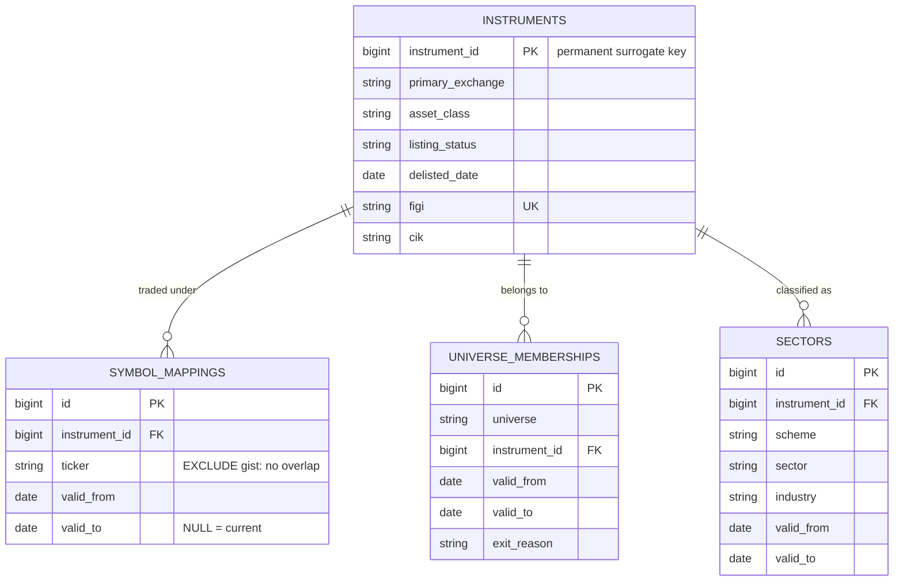
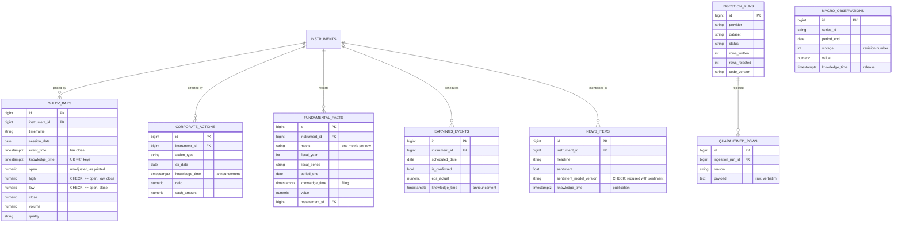
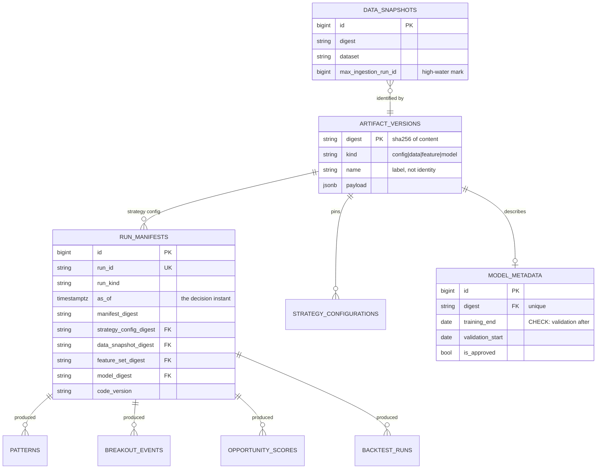
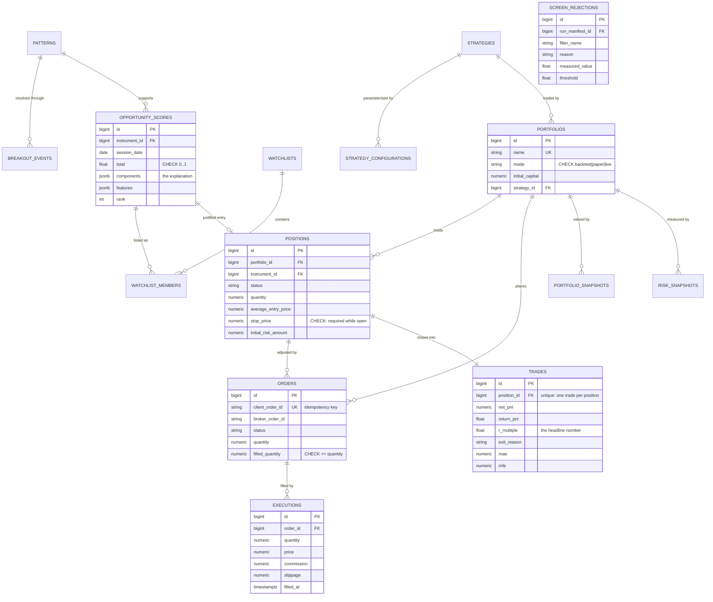
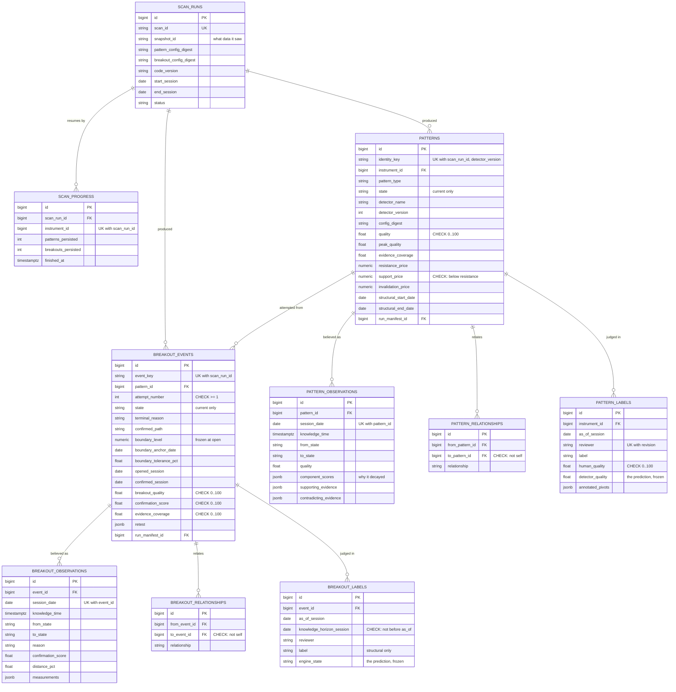
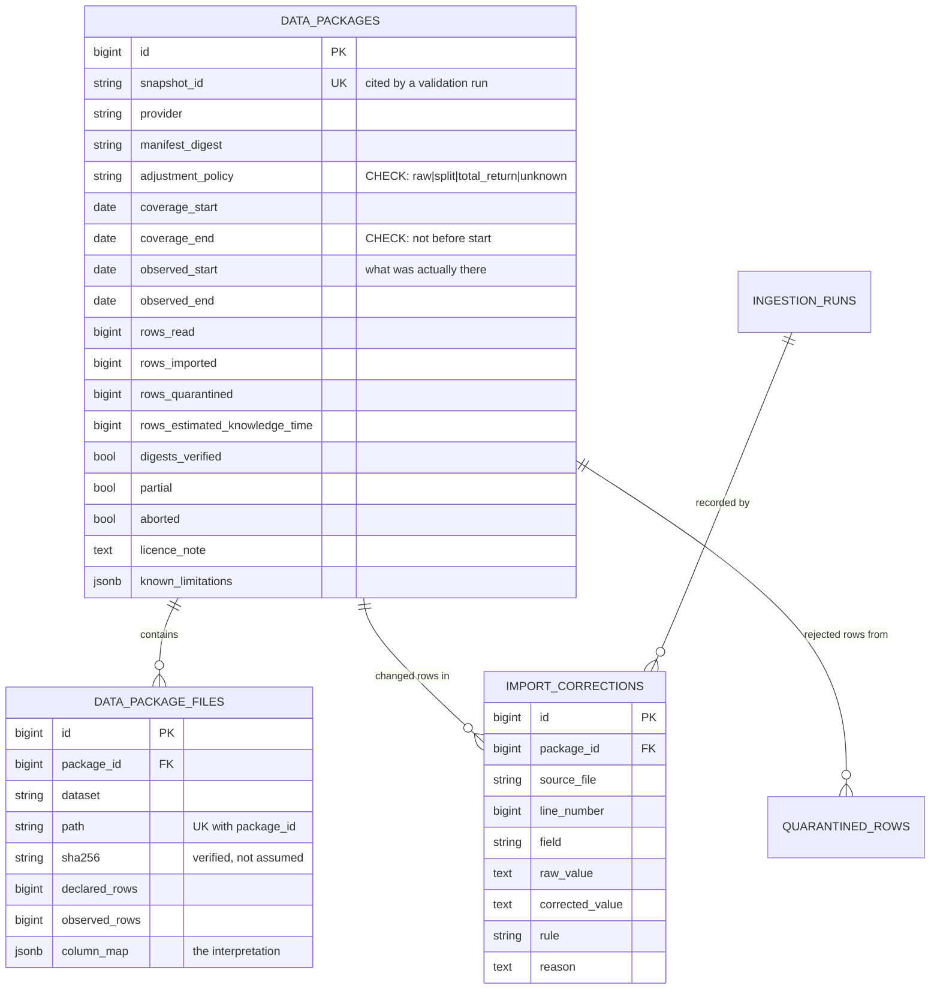
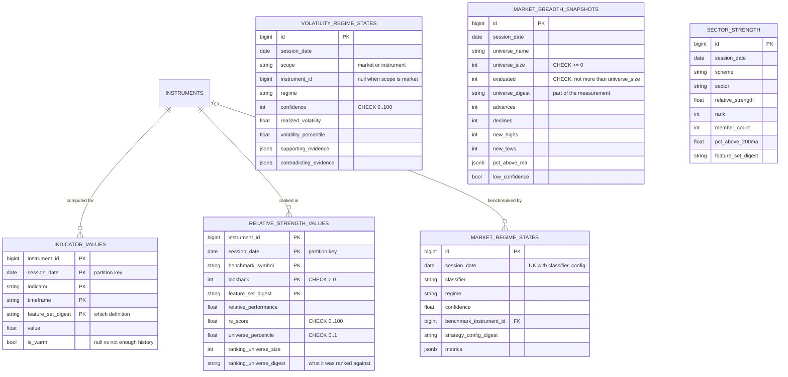

# Data Model

**70 tables are defined** in `src/tradeit/storage/tables.py` and created by
`migrations/versions/` — measured from the ORM metadata, not counted by hand.
The schema has been applied to PostgreSQL 16 and is verified by
`tests/integration/test_phase2_schema.py`, which includes a drift check
asserting the ORM and the migrations still agree.

**Every table is inventoried below, in exactly one of nine domains.** Each
domain opens with a table naming its members and what each is for; the diagrams
and the prose that follow cover the parts with design decisions worth
explaining. `tests/unit/test_documented_counts.py` compares the inventories
against the ORM metadata, so a table added to the code and not to a domain fails
the suite — as does one listed here that no longer exists, or one listed twice.

> **What this document used to be, since the correction is the useful part.** It
> was written in Phase 2, described 22 tables in five domains, and said nothing
> about the other 35: everything from Phase 4 (patterns), Phase 5 (breakouts),
> the empirical gate (offline packages and scan runs), and several Phase 2-era
> tables that were never written up. Its header had also read "49 tables in six
> domains", wrong on the count, the number of domains and the implication of
> completeness at once.
>
> **Two of its diagrams were worse than incomplete.** The `PATTERNS` and
> `BREAKOUT_EVENTS` blocks in Domain 4 described the *Phase 2 draft* of those
> tables — `status`, `pivot_price`, `stop_price`, `session_date`,
> `volume_ratio`, `follow_through_pct` — and not one of those columns survived
> Phase 4 and Phase 5, which replaced both designs deliberately and for stated
> reasons. They were drawn as current schema with nothing to mark them
> otherwise, which is a stronger failure than an omission: an absent table
> tells a reader to go and look, a stale one tells them not to bother. Both are
> now defined in Domain 6, and a test asserts that every field named in any
> diagram here exists on the table that diagram claims to describe.

> The five analytics tables added in Phase 3 — `relative_strength_values`,
> `market_breadth_snapshots`, `volatility_regime_states`, `feature_definitions`
> and `feature_set_members` — are covered in Domains 3 and 8 below;
> [PHASE_03.md §10](PHASE_03.md#10-database-changes) records what was true when
> they were introduced.

## The three kinds of table

The distinction drives most design decisions below.

| Kind | Mutability | Identity | Examples |
|---|---|---|---|
| **Facts** — things observed | Append-only, bitemporal | business key + `knowledge_time` | `ohlcv_bars`, `fundamental_facts`, `news_items` |
| **Derived** — things computed | Recomputable, replaced | business key + `feature_set_digest` | `indicator_values`, `opportunity_scores` |
| **Decisions** — things done | Immutable once written | surrogate + `run_manifest_id` | `executions`, `trades`, `journal_entries` |

Facts get revision history because a vendor can correct them and we must
remember what we believed. Derived data does not, because it can be recomputed
from facts plus a configuration — but it must record *which* configuration.
Decisions get neither, because they happened.

---

## Domain 1 — Identity and reference data

| table | what it is |
|---|---|
| `instruments` | The permanent surrogate identity. Everything else keys on `instrument_id`, never on a ticker |
| `symbol_mappings` | Which ticker an instrument traded under, over a half-open date range |
| `universe_memberships` | Which universe an instrument belonged to, over a date range, with `exit_reason` when it left |
| `sectors` | Classification under a named scheme, dated, because reclassification is not retroactive |

**Why intervals everywhere.** Tickers are recycled, universe membership changes,
and companies get reclassified. Every one of these is a half-open date range, so
resolving any of them requires a date. A PostgreSQL `EXCLUDE USING gist`
constraint on `symbol_mappings` makes two overlapping claims on one ticker
impossible while still permitting legitimate reassignment — verified in
`tests/integration/`.

**Why sectors are dated too.** A company reclassified from Technology to
Communication Services in 2018 was in Technology in 2017. A sector-rotation
backtest using today's mapping for all history is measuring a different
strategy from the one it claims to.

**`universe_memberships` is where survivorship safety is actually enforced.**
"Was NVDA in the S&P 500 on 2016-03-01?" is an interval query, and the CHECK
constraint `valid_to IS NULL OR valid_to > valid_from` makes a zero-length
membership impossible. A universe file listing today's constituents cannot
answer the question for any past date, which is precisely the defect the EDGAR
delisting denominator ([`EDGAR_DELISTING_DENOMINATOR.md`](EDGAR_DELISTING_DENOMINATOR.md))
exists to measure in a vendor's data.

---

## Domain 2 — Facts

| table | what it is |
|---|---|
| `ohlcv_bars` | Unadjusted price bars, append-only, one revision per `knowledge_time` |
| `corporate_actions` | Splits, dividends, ticker changes: `ratio`, `cash_amount`, `new_ticker`, keyed by `ex_date` and revision |
| `fundamental_facts` | One financial metric per row, with `restatement_of` pointing at what it superseded |
| `earnings_events` | Scheduled and actual earnings, with `is_confirmed` separating a vendor's estimate of the date from the announced one |
| `news_items` | Headlines with sentiment, where a score requires its model version |
| `macro_observations` | Economic series by `period_end` and `vintage` |
| `ingestion_runs` | One row per ingestion job: provider, dataset, status, rows written and rejected, code version |
| `quarantined_rows` | Rows that failed validation, kept verbatim with the reason, stage, file and line |

Established in Phase 1 and unchanged; `news_items` and `macro_observations` are
new and follow the same bitemporal contract. Every fact table's uniqueness
constraint includes `knowledge_time`, so revisions coexist rather than
overwrite, and every index leads with the point-in-time query shape.

`macro_observations` carries `vintage` because macro data is revised more
aggressively than anything else here — employment twice, GDP three times — and
vendor APIs typically serve only the current revision. Backtesting a regime
model on revised macro data produces a model that could not have existed.

**`corporate_actions` and `earnings_events` are facts, not adjustments.** The
action is recorded; prices are never rewritten in place. A 2-for-1 split is a
row with `ratio = 2` and its own `knowledge_time`, and any adjusted series is
derived at read time by `apply_adjustments` in `storage/repositories.py`, from
the actions knowable at the read's clock (ADR-0005). Storing adjusted prices
instead would make every historical bar depend on every later action, so a
corporate action landing tomorrow would silently change what a backtest run last
year "saw".

**`earnings_events.is_confirmed` separates two different claims.** A vendor's
projected report date is not the same fact as an announced one, and a strategy
that avoids holding through earnings behaves differently depending on which it
had. Both are stored, both carry `knowledge_time`, and the flag says which is
which rather than letting a later confirmation overwrite the estimate.

**`ingestion_runs` and `quarantined_rows` are why a gap is legible.** A
partially failed load that nobody noticed is otherwise indistinguishable from a
market holiday. The quarantine keeps the raw payload alongside the reason, and
its `stage` column — `normalized`, `validated`, `point_in_time` — names which of
three different problems occurred: the vendor's date format needs declaring, the
vendor's numbers contradict each other, or nothing in the source says when the
fact became knowable.

---

## Domain 3 — Reproducibility

| table | what it is |
|---|---|
| `artifact_versions` | Content-addressed store for configs, data snapshots, feature sets and models. The digest *is* the identity |
| `run_manifests` | One row per decision-producing run, pinning every digest and the code version |
| `data_snapshots` | The high-water `ingestion_run_id` per dataset, so replay sees exactly what the original run saw |
| `model_metadata` | Registry for learned models, with the training and validation windows that make look-ahead auditable |
| `feature_definitions` | The durable record of the feature registry, keyed by digest rather than name |
| `feature_set_members` | Which feature definitions belong to which `feature_set_digest` |

**`artifact_versions.digest` is the primary key.** Identity *is* content, so
inserting the same configuration twice is a no-op and two rows can never
disagree about what a digest means.

**`data_snapshots` closes a subtle reproducibility gap.** Bounding reads by
`as_of` is not quite sufficient: a backfill landing after a scan adds rows whose
`knowledge_time` precedes that scan's `as_of`, so replaying it legitimately sees
data the original run did not. Pinning the maximum `ingestion_run_id` per
dataset makes replay exact rather than merely honest.

**`run_manifests` is the anchor every derived row points back to.** Its
`run_id` is unique, and `strategy_config_digest`, `data_snapshot_digest`,
`feature_set_digest` and `model_digest` are all foreign keys into
`artifact_versions` — so a manifest cannot cite a configuration that was never
stored. Given a manifest id the exact inputs are reconstructible; without one, a
stored signal is an assertion nobody can check. It is deliberately *not* the
anchor for scans, which produce observations rather than decisions and have no
strategy digest to offer; those use `scan_runs` (Domain 6).

**`feature_definitions` is keyed by `digest`, not by `name`.** Two definitions
of `rs_score` with different lookbacks are different features, and one row for
both would lose exactly the distinction the registry exists to preserve. The
in-process registry is the source of truth during a run; this table is what
makes a two-year-old `feature_set_digest` still explainable after the code that
defined it has changed, and `feature_set_members` is the join that answers
"which definitions were in that set?".

**`model_metadata` exists although no phase trains a model.** `training_end` is
the field that matters: a model trained on data through 2023 must not be used to
score 2022, and a CHECK constraint requires `validation_start >= training_end`.
Introducing a model later without that metadata would make its look-ahead status
unauditable, and retrofitting the record is much harder than keeping it from the
start.

---

## Domain 4 — Opportunity and portfolio

| table | what it is |
|---|---|
| `opportunity_scores` | A dated score per instrument with its components, so the number is explainable |
| `screen_rejections` | What did *not* pass, with the filter, the measured value and the threshold |
| `watchlists` | A named, dated set of instruments under observation |
| `watchlist_members` | One instrument on a watchlist, with rank, trigger and stop, and the score that put it there |
| `strategies` | The long-lived identity of a strategy; its parameters live elsewhere |
| `strategy_configurations` | A versioned parameter set, active over an `activated_at`/`deactivated_at` interval |
| `portfolios` | An account the system manages, carrying the `backtest`/`paper`/`live` mode |
| `positions` | An open or closed holding, with the stop that defines its risk |
| `orders` | An instruction to the broker, idempotent on `client_order_id` |
| `executions` | Individual fills. The ground truth for what was actually paid |
| `trades` | One closed position's outcome: net P&L, R multiple, MAE and MFE |
| `portfolio_snapshots` | End-of-session portfolio state — the equity curve, one row per session |
| `risk_snapshots` | End-of-session risk: heat, exposures, correlations, limit breaches |

Patterns and breakout events appear in the diagram below because opportunity
scores rest on them; both are **defined in Domain 6**, which is where the
lifecycle they belong to is described.

Seven things worth calling out:

**`positions.stop_price` is enforced by CHECK while open.** A position without a
stop has undefined risk, cannot be sized, and cannot be aggregated into
portfolio heat. It is not a position this system will hold.

**`orders.client_order_id` is unique and generated before submission.** That
ordering is what makes retrying a timed-out submission safe: the same id is a
no-op at the broker rather than a second position.

**`executions` is the ground truth.** A position's average entry price is
derivable from its fills; if the two ever disagree, the executions are right.

**`screen_rejections` records what did *not* pass.** Storing only the survivors
makes "why isn't NVDA on the list?" answerable only by re-running the whole
chain.

**`portfolios.mode` is on the portfolio, not global.** A paper portfolio and a
live one can coexist, and every position, order and snapshot inherits its mode
from the portfolio it belongs to — which is what stops a simulation's fills from
ever being confused with real ones. The mode is CHECK-constrained to
`backtest`, `paper` or `live`, so there is no fourth state to drift into.

**`strategies` and `strategy_configurations` are split so a parameter change is
visible as a transition.** A strategy is a long-lived identity ("baseline
breakout"); its parameters change over time. Keeping them in one table would
make a performance history end at every tuning, or — worse — continue across one
as though nothing happened. The `activated_at` / `deactivated_at` interval, with
a CHECK that deactivation follows activation, makes "which configuration was
live on 14 March?" a query, and `digest` is a foreign key into
`artifact_versions` so the parameters themselves are content-addressed rather
than described.

**`portfolio_snapshots` and `risk_snapshots` are written whether or not anything
traded, and the quiet sessions are the point.** An equity curve reconstructed
from trades alone omits open-position marks, which is most of the volatility.
The risk row is what answers "was that drawdown a risk-control failure or an
ordinary run of losses?" months later, when nobody remembers — `heat_pct`,
`largest_position_pct`, `max_pairwise_correlation`, `sector_exposures` and any
`limit_breaches`, recorded as they stood rather than reconstructed afterwards.

**`watchlists` are dated, and a member carries why it is there.** The unique
constraint is `(name, session_date)`, so "the momentum list" is a different row
every session rather than a mutable object whose history is destroyed each
morning. `watchlist_members.score_id` points at the `opportunity_scores` row
that justified the inclusion, which is what makes a stale watchlist auditable
instead of merely old.

---

## Domain 5 — Evaluation and operations

| table | what it is |
|---|---|
| `backtest_runs` | One simulation, its headline statistics, and the data caveats carried forward from ingestion |
| `backtest_trades` | Simulated trades. Structurally near-identical to `trades`, and deliberately a separate table |
| `monte_carlo_runs` | A distributional study over a backtest result: percentiles, not a point estimate |
| `journal_entries` | Why something was done, with the context that made it reasonable at the time |
| `job_runs` | One attempt at one scheduled job; the source of the trading gate |
| `data_quality_issues` | Problems detected *across* rows, with whether they block trading and when they were resolved |
| `system_logs` | Structured operational log, partitioned monthly and dropped by partition |

**`backtest_trades` is separate from `trades` on purpose.** They are structurally
near-identical, and that is exactly the risk: one accidental `UNION` between
simulated and real fills turns a live performance report into fiction. Separate
tables make that mistake require intent.

**`backtest_runs.data_caveats` carries provider limitations forward** from
ingestion — survivorship-unsafe universe, estimated filing dates, adjusted-only
prices — so a result cannot be quoted as clean when the data underneath it was
not. Eight months later nobody remembers which vendor was in use.

**`job_runs` is the trading gate.** Before generating a plan, the system checks
that every `blocks_trading` job completed for the session. Nine of the 22
catalogued jobs carry that flag.

**`monte_carlo_runs` stores percentiles rather than a point estimate.** The
drawdown that happened to occur in one historical ordering is an anecdote; the
5th percentile of maximum drawdown across resamplings is the number that should
size a live position. `seed` and `iterations` are recorded so a study is
repeatable, and a CHECK requires at least 100 iterations — a distribution
estimated from a handful of paths is a point estimate wearing a percentile's
label.

**`data_quality_issues` is not `quarantined_rows`.** That table holds rows that
failed to parse; this one holds problems visible only *across* rows — a missing
session, a 40% move with no corresponding corporate action, a series that has
not updated in a week. None of those is detectable row by row, and
`blocks_trading` is what connects a finding to the gate above rather than
leaving it in a report nobody reads.

---

## Domain 6 — Pattern and breakout lifecycle

| table | what it is |
|---|---|
| `scan_runs` | One execution of the pattern/breakout scan over one snapshot. The provenance anchor for everything below |
| `scan_progress` | One completed instrument within one scan. The resume ledger |
| `patterns` | One pattern **identity**, from first detection to terminal state. Holds current state only |
| `pattern_observations` | Append-only: what that pattern looked like on one session |
| `pattern_relationships` | Directed edges between patterns — nested, superseded, or an alternative reading |
| `pattern_labels` | A human's opinion of a pattern, with the detector's own prediction stored alongside |
| `breakout_events` | One breakout **attempt** at one boundary, from first approach to resolution. Current state only |
| `breakout_observations` | Append-only: what that attempt looked like on one session |
| `breakout_relationships` | Directed edges between attempts — same region on two timeframes, nested, or a retest |
| `breakout_labels` | A human's *structural* judgement of an attempt, with the knowledge horizon it was made under |

**Identity is one row per thing, not one row per session.** Both the Phase 2
drafts got this wrong in the same way and were replaced for the same reason.
`patterns` keyed uniqueness on `(instrument, type, start_date, detected_on)`,
minting a new row every day the same structure was re-detected; `breakout_events`
keyed on `(instrument, pattern, session, status)`, which is a log rather than an
identity, so "how many attempts has this pattern made at this level?" had no
answer. Both now key on a content hash — `identity_key` and `event_key` — over
the things that do *not* change as the thing evolves.

**The current-state row can be mutable because the history is unwritable.**
`pattern_observations` and `breakout_observations` are append-only with a unique
constraint on `(parent, session_date)`, so a second write for a session is a
conflict rather than an overwrite. A pattern that was MATURE at quality 88 on
40% coverage on Wednesday was exactly that on Wednesday, whatever Thursday
brought — and an event that failed on Thursday still records that it was
CONFIRMED on Tuesday. Component scores are stored per observation, which is what
makes "why did this decay?" answerable at all; the composite alone cannot say.

**The breakout boundary is copied into the event, not referenced through the
pattern.** The pattern layer legitimately refines its levels as touches
accumulate, so an event read back through a live pattern would be judged against
a level that partly reflects the breakout it is judging. `boundary_level`,
`boundary_anchor_date` and `boundary_tolerance_pct` are frozen when the attempt
opens.

**`detector_version` and `config_digest` are not decoration.** A scoring rule
that changes in v1.1 produces different numbers from v1.0. A backtest that
silently recomputes history under the newest detector and presents the result as
unchanged is the specific dishonesty they prevent, and they are part of the
pattern's uniqueness key so the two versions' outputs cannot merge.

**Both relationship ontologies are deliberately small**, and both are edge
tables rather than a `parent_id` column, because the relationships are
many-to-many and directional: a weekly base containing three daily flags is
ordinary, and a structure can be a TIGHT_CONSOLIDATION and a BULL_FLAG at once.
Forcing exclusivity would discard what a later scoring stage is better placed to
decide. A CHECK constraint forbids self-relations on both.

**`breakout_labels` has no outcome column, and cannot be given one.** Nobody is
asked "did the stock make money afterwards?" — future returns attach separately,
later, with their own knowledge horizon. Mixing them in here would produce a
dataset whose labels silently encode returns and whose every downstream use
would be circular. `knowledge_horizon_session` is what makes the remaining
labels honest: a FALSE_BREAKOUT judgement cannot be made from the breakout bar
alone, so the last session the reviewer was shown is recorded rather than
inferred from what the label must have required.

**Multiple reviewers per example is the point.** A single reviewer's rating is
one opinion about a subjective judgement; inter-reviewer agreement is what turns
opinions into a measurement. Both label tables key on
`(…, reviewer, revision)`, and both store the engine's own prediction alongside
so agreement is computable without re-running a possibly-changed detector.

**`scan_runs` is separate from `run_manifests`, and inventing a digest would be
worse than the separation.** A manifest anchors decision-producing runs and
requires a strategy configuration; a scan produces observations, not decisions,
and has no strategy to cite. `scan_progress` is written in the same transaction
as that instrument's patterns and breakouts, so a progress row exists if and
only if the observations were committed — an interrupted scan resumes at
instrument granularity with no duplicates and no half-scanned series.

---

## Domain 7 — Offline packages and import provenance

| table | what it is |
|---|---|
| `data_packages` | One import of one offline vendor package, with what the package claimed about itself |
| `data_package_files` | One file inside that package, its verified digest, and the column mapping used to read it |
| `import_corrections` | Every deviation from the source text, with the rule that made it and the line it came from |

**Declared and observed are separate columns throughout, and that is the whole
design.** `coverage_start` / `coverage_end` are what the vendor's manifest
claimed; `observed_start` / `observed_end` are what the files actually
contained. `declared_rows` and `observed_rows` are the same distinction one
level down. A package that says it covers 1998–2024 and delivers 2003 onward is
a fact worth having in a row rather than a discovery someone makes during a
backtest.

**`adjustment_policy` is stored rather than referenced.** A package's claim
about its own prices is part of the evidence: a result computed from
split-adjusted prices is a different result from one computed from raw prints,
and six months later this row is the only record of which it was. It is
CHECK-constrained to four values, and `unknown` is one of them — a vendor that
does not say gets recorded as not having said, not as raw.

**`snapshot_id` is derived from the manifest digest and the observed row
counts.** So an import that aborted halfway cannot share an id with one that
finished over the same files, and `partial` and `aborted` are stored explicitly
alongside rather than inferred from a count comparison.

**`column_map` is the interpretation, not metadata.** The same bytes read with
`close` mapped to an adjusted-close column produce a different history. Without
the mapping, nobody can tell afterwards which reading happened — and the digest
proves only that the bytes were the ones expected, never that they were read the
way they were meant.

**`import_corrections` is high-volume by construction and that is accepted.** A
vendor that pads every number produces one row per cell. The alternative is a
pipeline whose changes to your data are invisible, which is worse; the
importer's report carries per-dataset counts so the common case never requires
reading this table. What it buys is that "the importer changed my data" is a
query — field, raw text, substituted value, rule name, reason, addressable back
to the file and line.

---

## Domain 8 — Derived analytics and market context

| table | what it is |
|---|---|
| `indicator_values` | Materialised indicator output. The highest-volume table in the system |
| `relative_strength_values` | Security-versus-benchmark performance and its cross-sectional percentiles |
| `market_regime_states` | Daily market-environment classification, one row per (session, classifier, config) |
| `volatility_regime_states` | Daily volatility regime with its supporting and contradicting evidence |
| `market_breadth_snapshots` | Daily breadth over an explicitly recorded eligible universe |
| `sector_strength` | Daily sector aggregates for rotation analysis |

**Derived rows are recomputable, so they carry no revision history — but they
must say which definition produced them.** Every table here keys on
`feature_set_digest` or `strategy_config_digest`. A changed definition writes new
rows under a new digest rather than silently overwriting the old ones, which is
what lets a two-year-old backtest and today's scan disagree legibly instead of
one quietly becoming the other.

**`indicator_values.is_warm` distinguishes "not enough history" from "genuinely
null".** The analytics contract requires callers to tell those apart: a 200-day
moving average on day 40 does not exist, and treating that as a null value is how
a warmup artefact becomes a signal.

**`market_regime_states` and `volatility_regime_states` are separate because the
two judgements are independent.** A market can trend strongly *with* elevated
volatility. One row carrying both would force a single `confidence` number for
two different questions, and whichever way that number was set it would be wrong
about one of them.

**A regime is a property of the market, computed once.** The uniqueness key is
`(session_date, classifier, strategy_config_digest)` — not per instrument — so a
regime cannot come out differently for two names on the same day.

**`universe_digest` and `ranking_universe_digest` are part of the measurement,
not metadata about it.** Comparing a 2008 breadth reading computed over 500
survivors with a 2024 reading computed over 4,000 names is comparing two
different statistics. The digest is what makes that detectable rather than
invisible, and `evaluated` versus `universe_size` — with a CHECK that the first
cannot exceed the second — records how much of the intended universe actually
had data. `low_confidence` is set rather than the row being withheld, because a
thin reading and a missing reading are different facts.

---

## Domain 9 — research-01 securities, identity and facts

**Twelve tables that share nothing with Domain 1, on purpose.** Domain 1 keys
everything on `instruments`, and one `instruments` row carries an issuer key
(`cik`), a security key (`figi`), a listing venue (`primary_exchange`) and a
lifecycle (`listing_status`/`delisted_date`) at once. That is serviceable for the
Daily machinery and disqualifying for survivorship research, where the question
is *which of those four ended, and when*.

So `ohlcv_bars`, `corporate_actions` and `symbol_mappings` are **not** older
names for `security_price_facts`, `security_corporate_action_facts` and
`symbol_aliases`. They are those tables' concepts fused together. Nothing in
Domain 1 was renamed, re-keyed or extended — all of it is load-bearing for
`full-01`.

| table | what it is |
|---|---|
| `issuers` | A legal issuing entity. Carries **no** `cik`: its key lives in `issuer_identifiers` under a namespace |
| `issuer_identifiers` | The namespaced keys that *are* this issuer — exactly one `primary`, any number of `corroborating` |
| `issuer_sic_observations` | One filing's statement of this issuer's SIC code, with the accession that said it. **Observations, not a label** — SIC changes, and "as of 2008" is the only version of the question a backtest asks |
| `issuer_related_identities` | Identifiers that appear to describe this issuer and have not been shown to. A separate table so an unproven key can never resolve identity |
| `securities` | One class of securities issued by one issuer. Holds no ticker and no venue |
| `security_identifiers` | CUSIP / ISIN / FIGI — identifiers of a *security*, kept out of the issuer namespace |
| `listings` | Where a security was listed and between which dates. The venue string is stored verbatim |
| `symbol_aliases` | A ticker or vendor symbol standing for a security over an interval, with point-in-time provenance |
| `security_relationships` | Directed, evidenced claims between two securities — succession, merger, ticker reuse |
| `filings` | One filing, keyed on the **issuer**, because registrants file and securities do not |
| `security_price_facts` | Daily bars carrying an explicit `adjustment_basis`, so raw, split and total series coexist |
| `security_corporate_action_facts` | Splits, dividends and other actions on a security. Carries no `new_ticker` |
| `security_fundamental_facts` | Narrow financial facts for a security, with an `as_reported` / `restated` basis |

**The names depart from `PHASE_06_IMPROVEMENT_PLAN.md` §8 deliberately.** The
plan says `price_facts`, `corporate_action_facts` and `fundamental_facts`. Only
the last collided with an existing table, but all three took the `security_`
prefix, because a name that states its subject cannot be confused with the
near-neighbour beside it. `price_facts` sitting next to `ohlcv_bars` invites the
wrong join; `security_price_facts` does not.

### Identity is regulator-neutral, and `FRC` is why

`issuers` has no `cik` column because the SEC is not the only registry that
identifies an issuer. **First Republic Bank has no SEC filer account at all** —
a bank with no holding company files its Exchange Act reports with the FDIC — and
is discriminated by `FDIC_CERT:59017`, corroborated by `FRB_RSSD:4114567`. A
`cik` column would have made it unrepresentable, or invited a fabricated number.

Its SEC subject-company CIK `1132979` is recorded in `issuer_related_identities`
as **unresolved**: that record reports EIN `88-0157485` while the FDIC registrant
reports `80-0513856`, and sameness is established in neither direction. Keeping
it in a separate table rather than as a third `role` is what makes it
*structurally* unable to identify the issuer — a resolver reading
`issuer_identifiers` cannot reach it.

Three constraints carry the guarantees, and `tests/unit/test_research01_schema.py`
exercises each:

- `uq_issuer_primary_identifier` — a **partial** unique index admitting one
  `primary` per issuer. Two co-equal primaries discriminate nothing.
- `uq_issuer_identifier_global` — unique on `(namespace, value_normalized)`
  across every issuer, so one registry value naming two issuers collides.
- `value` is stored verbatim, leading zeros and all; `value_normalized` carries
  `str(int(value))` and is the only column compared, matching
  `IdentifierRef.key`.

### There is no bridge to `instruments`, and that is an open question

No foreign key, no view, no join. Deciding that instrument *i* and security *s*
are the same thing is an **identity claim requiring evidence**, on the same
footing as a control mapping — and the obvious shortcut, joining on
`instruments.cik`, is wrong twice over: it assumes an SEC CIK exists, and it
assumes a CIK identifies a security rather than a registrant, when one registrant
lists several classes.

**Whoever builds that bridge needs an evidence rule and a mapping-quality state,
not a join.** See `docs/EDGAR_DELISTING_DENOMINATOR.md` §4.

## Partitioning

Three tables are range-partitioned; the other 54 are not, and that asymmetry is
deliberate. Partitioning costs planning time and operational complexity, so it
is applied where row counts justify it and nowhere else. (This paragraph read
"two" until `relative_strength_values` was added in Phase 3 and the count was
not revisited — the same rot the header caveat describes, one section further
down.)

| Table | Key | Interval | Rationale |
|---|---|---|---|
| `indicator_values` | `session_date` | monthly | ~58M rows/year (4,000 instruments × 58 indicators × 252 sessions). The indicator count is measured from the feature registry under the shipped `baseline.toml`, and it is **configuration-dependent** — a config declaring more periods produces more rows, so this is a sizing estimate for that config rather than a fixed property of the schema. Every query is date-bounded, so pruning eliminates almost all of it. |
| `relative_strength_values` | `session_date` | monthly | ~12M rows/year (4,000 × 3 benchmarks × 4 lookbacks × 252). Same query shape. |
| `system_logs` | `logged_at` | monthly | High write volume, short useful life, retention by partition drop. |

All three use a **natural composite primary key** rather than a surrogate id.
PostgreSQL requires a partitioned table's primary key to contain the partition
column, and for `indicator_values` nothing references a row by id anyway — the
natural key `(instrument_id, session_date, indicator, timeframe,
feature_set_digest)` is already unique, and a `BIGSERIAL` plus its index would
be pure overhead at that scale. `system_logs` uses `(logged_at, event_id)` with
a client-generated UUID, avoiding a sequence contended by several workers.

**Verified behaviour** (`tests/integration/test_phase2_schema.py`):

- 28 monthly partitions are created by the migration, covering 24 months back
  and 2 months forward.
- A row dated 2026-03-16 routes to `indicator_values_p202603`.
- A date-bounded query prunes 26 of 28 subplans.
- `tradeit_ensure_month_partition()` is idempotent, so the weekly maintenance
  job can run repeatedly.
- Retention is `DROP TABLE indicator_values_p202409` — instant, no bloat, no
  vacuum storm.

A `DEFAULT` partition exists as a backstop so a late maintenance run cannot
cause a failed load. It must stay empty: PostgreSQL refuses to attach a new
partition whose range overlaps rows already sitting in the default, so a row
landing there converts a scheduling lapse into a migration problem. A test
asserts it is empty.

### `ohlcv_bars` is deliberately not partitioned yet

At roughly 1M rows per year for a 4,000-name daily universe, it does not need
it. Partitioning it later requires changing its primary key from `id` to
`(id, session_date)`, which is a table rewrite — cheap while the table is small,
and it should be done before intraday bars are ingested, since minute bars would
multiply the row count by ~390. Recorded as an open issue rather than done
speculatively.

---

## Index strategy

Indexes follow query shape, not intuition:

| Pattern | Index form | Why |
|---|---|---|
| Point-in-time fact read | `(instrument_id, …, knowledge_time)` | Every read filters on `knowledge_time`; leading with the query shape makes the correct query the fast one |
| Interval resolution | `(ticker, valid_from, valid_to)` | Ticker-to-instrument on a date |
| Indicator lookup | `(instrument_id, indicator, session_date)` | One instrument's series |
| Cross-sectional scan | `(session_date, indicator)` | One date's whole universe, for ranking |
| Ranking | `(session_date, total)` | Top-N candidates |
| Open positions | `(portfolio_id, status)` | The hot path on every risk check |

The two indicator indexes are complementary, not redundant: relative strength
needs the cross-section, indicator computation needs the time series, and one
composite cannot serve both.

---

## Conventions

- **Prices, cash and quantities are `NUMERIC`.** Never float. Indicators and
  scores are `double precision`, because a 1e-15 error in an RSI is noise while
  the same error in a cash ledger is a reconciliation failure.
- **Timestamps are `timestamptz`, always UTC**, through the `UTCDateTime` type
  which rejects naive datetimes on write and attaches UTC on read.
- **Enums are `VARCHAR` with application-level enums**, not PostgreSQL `ENUM`
  types. Adding a member to a PG enum is a migration with locking implications;
  the CHECK-constrained string columns cost a few bytes and avoid that.
- **JSONB only where the shape is genuinely open** — score components, journal
  context, config payloads. Anything queried by a fixed name gets a real column.
